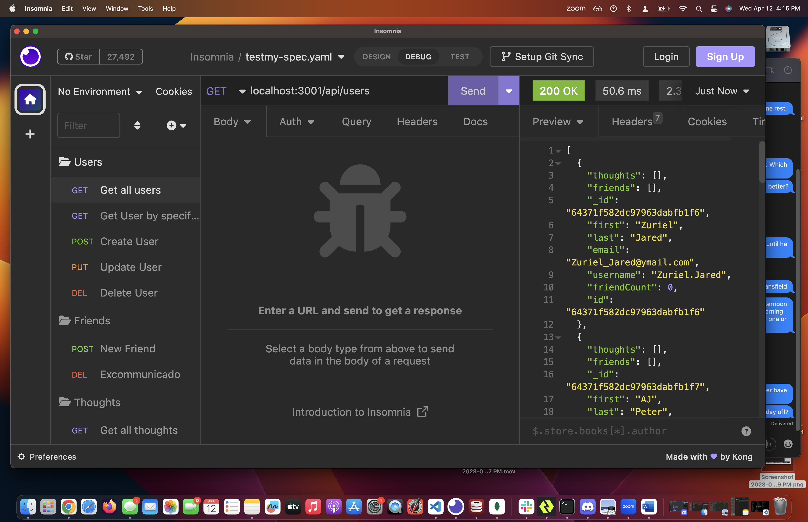

# NoSQL:Social Networking API

## Description

I was wanting to create a basic social networking app using MongoDB to be able to store a vast amount of data as documents and allow interaction between the documents.  With it you can add, update, view and delete a user, add or remove friends, add, update, delete thoughts as well as add or delete a reaction.

## Installation

To run the application first clone the repo then type “nom run seed” after that type “npm start”

## Usage

The following is a link to a video walkthrough of the application.

https://drive.google.com/file/d/1rQHng6KxNelDAqPICiEjWM-BUF-Mi7Pj/view 

The following are some screenshots during various points of interaction within the application.

